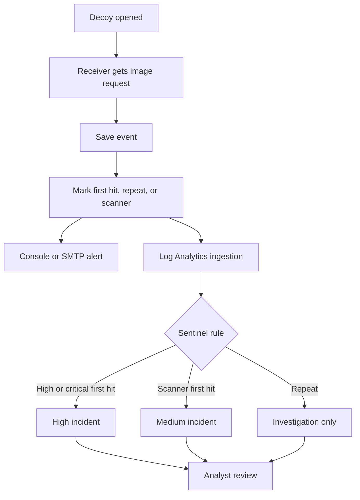

# Architecture

## Main parts

| Part | Job |
| --- | --- |
| Decoy generator | Creates a DOCX or HTML file with a callback image. |
| Local receiver | Stores events in SQLite and sends local alerts. |
| Azure receiver | Runs in Container Apps and accepts controlled HTTPS callbacks. |
| Table Storage | Stores cloud events and delivery results. |
| Logs Ingestion adapter | Sends redacted events to `CanaryHit_CL`. |
| Sentinel rules | Creates High incidents for eligible first hits and Medium incidents for scanner first hits. |
| Managed identity | Gives the app only the Azure permissions it needs. |

## Important rules

- The event is saved before alerting or SIEM ingestion.
- Alert and ingestion failures are recorded separately.
- Repeat matching uses the token and User-Agent within the configured window.
- The raw callback token is not sent to the event API or Sentinel; records use a hashed canary ID.
- Forwarded headers are ignored by default, so `SourceIp` is the direct connection peer.

## Source files

- [Receiver and routes](app/main.py)
- [SQLite backend](app/db.py)
- [Azure Table backend](app/azure_storage.py)
- [Logs Ingestion adapter](app/azure_ingestion.py)
- [Infrastructure and Sentinel rule](infra/main.bicep)

[Receiver fields](docs/architecture.md) - [Azure deployment](AZURE_DEPLOYMENT.md) - [Validation](VALIDATION.md)
