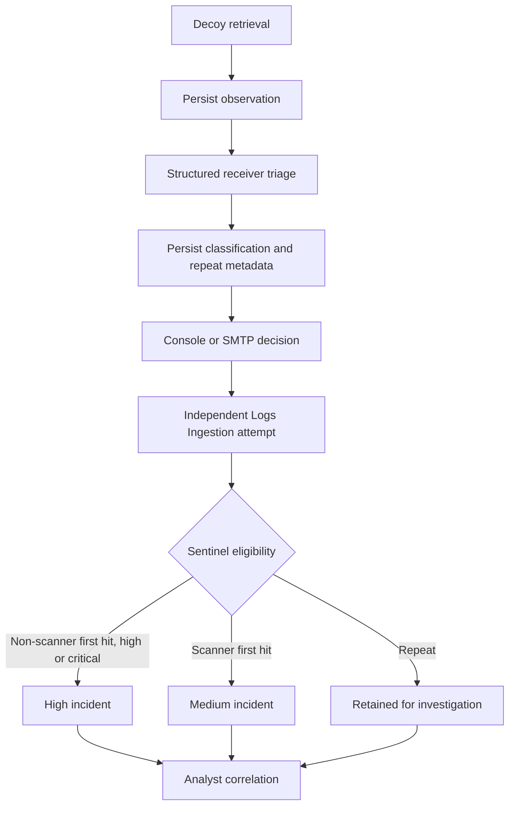

# Architecture

The original tests exercised local Word → SQLite and controlled callback → Azure → Sentinel separately. Release 0.2.2 also traced Word → public Azure receiver → Table Storage → Log Analytics → High Sentinel incident.

## Current detection flow

The image above preserves the original two exercised paths. The flowchart describes current processing; [validation](VALIDATION.md) records which paths were demonstrated for this release.

## Components and connections

| Component | What it did in the run |
| --- | --- |
| Local generator and Word | Created a DOCX with an external pixel; Word requested the loopback receiver |
| Local receiver | Stored the callback in SQLite and recorded triage and console-alert outcomes |
| Azure receiver | Accepted controlled HTTPS callbacks and a real Word request in Container Apps; management routes returned 404 |
| Azure Table Storage | Stored events and delivery outcomes in `CanaryHits`; `NotificationOutbox` remains unused |
| Notification handler | Recorded console or SMTP delivery independently of Sentinel ingestion |
| Logs Ingestion adapter | Sent normalized events through the Direct DCR into `CanaryHit_CL` |
| Sentinel rule | Separates eligible High first hits from Medium scanners; excludes repeat rows |
| Managed identity | Supplied scoped registry, storage, and DCR permissions |

## Source files

- [Receiver and routing](app/main.py)
- [Azure Table backend](app/azure_storage.py) and [SQLite backend](app/db.py)
- [Logs Ingestion adapter](app/azure_ingestion.py)
- [Infrastructure and Sentinel rule](infra/main.bicep)

Events are written before delivery. A failed SMTP or DCR operation remains visible in the event record; an absent adapter is recorded as disabled.

[Receiver boundaries and event fields](docs/architecture.md) · [Azure deployment](AZURE_DEPLOYMENT.md) · [Operational limits](LIMITATIONS.md)
