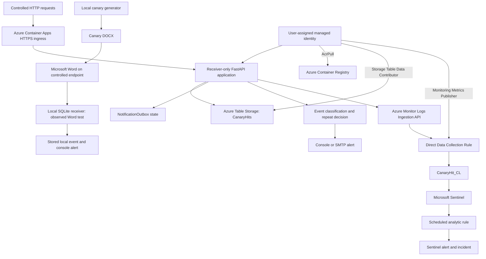

# Architecture

The work added the Azure branch to the existing local receiver. Controlled HTTP requests exercised the cloud path; Word exercised the separate loopback path.

The handler stored events before attempting notification. SMTP failures retained a failed status and did not skip the Sentinel adapter. An absent adapter was recorded as disabled. Delivery remained synchronous; [operational limits](LIMITATIONS.md) covers retry and concurrency behavior.
