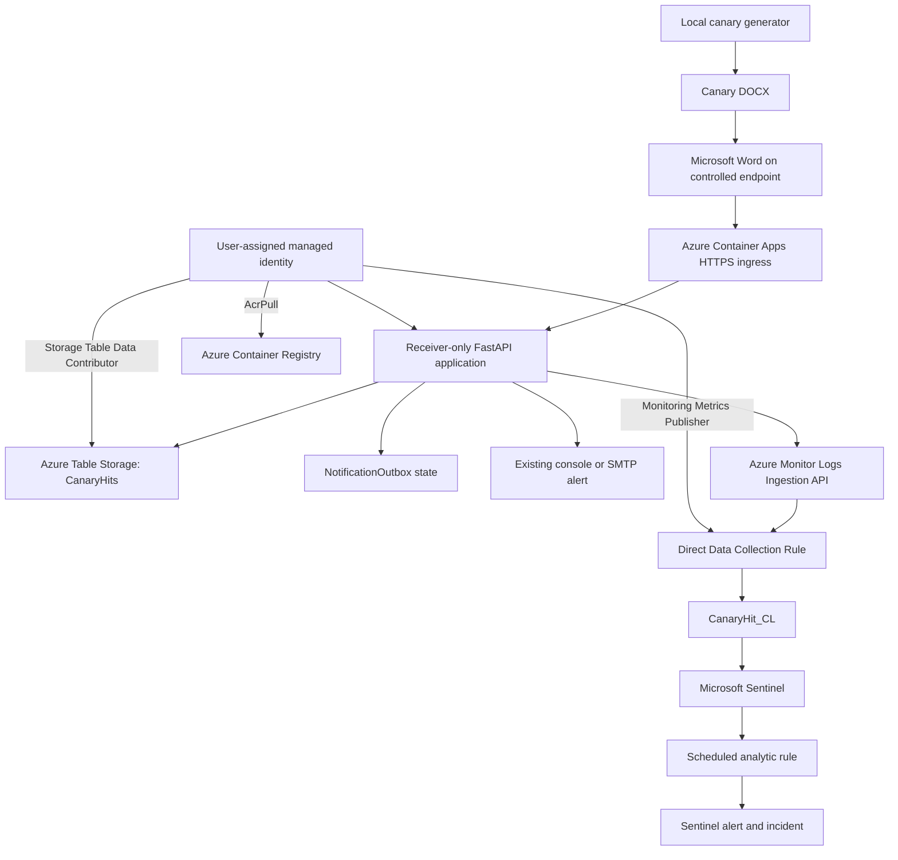

# Architecture

The callback persists a hit before attempting email or Azure Monitor delivery. The Azure receiver does not expose management routes; token and decoy provisioning can happen locally with the same Azure Table backend using the operator's `DefaultAzureCredential`.
