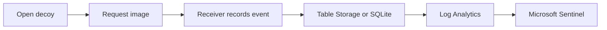

# Honey Token

This project uses decoy Word and HTML files to detect when they are opened. Each decoy loads a small image from the receiver. The receiver records the request and can send the event to Microsoft Sentinel.

[Case study](CASE_STUDY.md) - [Screenshots](docs/evidence/public/README.md) - [Run locally](docs/SETUP.md) - [Architecture](ARCHITECTURE.md)

## What I built

- A FastAPI receiver with SQLite for local runs.
- DOCX and HTML decoy generation with one callback token per file.
- An Azure version that uses Container Apps, Table Storage, Log Analytics, and Microsoft Sentinel.
- Sentinel rules that separate first access, scanner-like requests, and repeats.
- Console and SMTP alerts, with delivery status saved on the event.

## What happens

1. I create a token and a decoy file.
2. The file contains a request for a small image.
3. When the file is opened, the request reaches `/t/{token_id}/pixel.gif`.
4. The receiver saves the event and marks it as a first hit, repeat, or scanner-like request.
5. Local events stay in SQLite. Cloud events go to Table Storage and Log Analytics.
6. Sentinel creates an alert for eligible first hits. Repeat events stay available for investigation but do not create another alert.

Scanner-like requests are marked Medium. Other first hits use the severity set on the token. Public event output and SIEM records use a hash of the token instead of the raw token.

## Local demo

The demo opens `Financial_Records_CONFIDENTIAL.docx` in Word and records the callback from the local receiver.

## Results

| Test | Result |
| --- | --- |
| Word -> Azure -> Sentinel | The Word event reached Table Storage, Log Analytics, and High incident 17. |
| Cloud callbacks | Six events were stored and ingested. Sentinel created two High incidents and one Medium scanner incident. |
| Repeat callbacks | Three repeats were stored and did not create extra alerts. |
| Local SMTP | Two events were stored and one email was accepted by the local SMTP sink. |
| Test suite | `pytest -q` passed 43 tests. |

## Documentation

- [Case study](CASE_STUDY.md) - what I changed and what happened.
- [Setup](docs/SETUP.md) - run the receiver locally or deploy it to Azure.
- [Architecture](ARCHITECTURE.md) - the main components and data flow.
- [Sentinel rules](SENTINEL.md) - event fields, rules, and investigation queries.
- [Validation results](VALIDATION.md) - test and cloud results.
- [Screenshots and evidence](docs/evidence/public/README.md) - saved proof from the runs.
- [Cost and teardown](COST_AND_TEARDOWN.md) - resource cleanup command.

## Limits

The documents use synthetic data. A callback shows that a file requested the image; it does not identify a person or prove that a document was copied. Scanner detection is a heuristic, and viewer behavior depends on Office and endpoint policy.

## License

[MIT](LICENSE)
