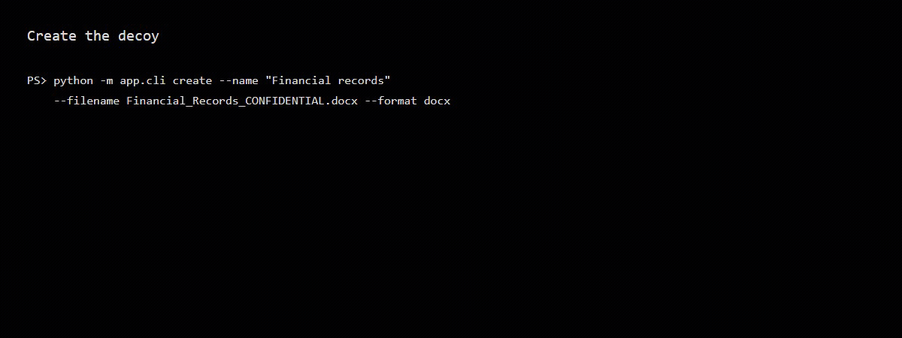

# Honey Token

Built an Azure-backed document-honeytoken receiver and connected its events to Microsoft Sentinel. The work extended a local Python service with durable storage, managed-identity ingestion, and a scheduled detection rule. A separate Word test confirmed that the generated DOCX requested its local callback.

[Case study](CASE_STUDY.md) · [Screenshots](docs/evidence/public/README.md) · [Run locally](docs/SETUP.md) · [Architecture](ARCHITECTURE.md)

**Built with:** Python, FastAPI, SQLite, Azure Table Storage, Container Apps, Bicep, Log Analytics, KQL, Microsoft Sentinel, Docker, and GitHub Actions.

## Local demo

[Watch the MP4](docs/demo/local-word-callback.mp4)

The local Word recording and the Azure-to-Sentinel evidence cover separate test paths; the Sentinel path is documented in the [case study](CASE_STUDY.md).

## Implementation

- Added an Azure Table backend while retaining SQLite for local runs.
- Deployed a receiver with public callback routes, disabled management routes, and scoped managed-identity permissions.
- Connected stored events to Log Analytics and Sentinel; corrected the ingestion endpoint after the first delivery failed.
- Fixed SMTP failure handling and malformed-key errors, and expanded the regression suite from nine to 16 tests.
- Restricted the Docker build context, bound Compose to loopback, and disabled access logs containing callback tokens.

## Recorded results

| Path exercised | Result | Evidence |
| --- | --- | --- |
| Local Word document | Word requested the pixel; the receiver stored a high-severity event and a sent console alert | [Word callback](docs/evidence/public/README.md#07-word-callback-and-triage) |
| Controlled Azure callback | The event reached Table Storage and Log Analytics; the scheduled rule created a high-severity incident | [Sentinel incident](docs/evidence/public/README.md#11-sentinel-incident) |
| Repeat callback and local SMTP | Both callbacks were stored; one email was delivered within the suppression window | [Test results](TESTING.md) |

The Word and Azure paths were tested separately. [Viewer coverage](COMPATIBILITY.md) and [operational limits](LIMITATIONS.md) record the scope of those results.

## Documentation

| Topic | Links |
| --- | --- |
| Build and investigation | [Case study](CASE_STUDY.md), [screenshots](docs/evidence/public/README.md), [starting point](docs/BASELINE.md) |
| Implementation | [Architecture](ARCHITECTURE.md), [Azure deployment](AZURE_DEPLOYMENT.md), [Sentinel rule and queries](SENTINEL.md) |
| Run and maintain | [Setup](docs/SETUP.md), [tests](TESTING.md), [security](SECURITY.md), [cost and teardown](COST_AND_TEARDOWN.md) |

Examples use synthetic documents and controlled test systems. Use is limited to environments the operator owns or has permission to monitor.

## License

[MIT](LICENSE)
