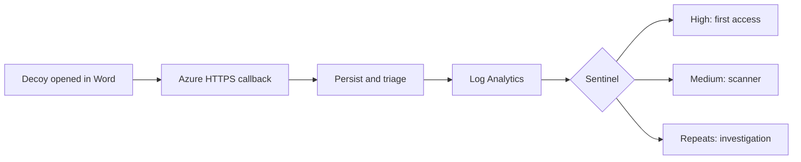

# Honey Token

Built a document honeytoken receiver that records decoy retrieval and carries its triage decision into Microsoft Sentinel. Active non-scanner first hits create High incidents; scanner first hits create Medium incidents. Repeat callbacks remain available for investigation while notifications and new analytic alerts are suppressed.

[Case study](CASE_STUDY.md) · [Screenshots](docs/evidence/public/README.md) · [Run locally](docs/SETUP.md) · [Architecture](ARCHITECTURE.md)

**Stack:** Python, FastAPI, SQLite, Azure Table Storage, Container Apps, Bicep, Log Analytics, KQL, Microsoft Sentinel, Docker, and GitHub Actions.

## Local demo

[Watch the MP4](docs/demo/local-word-callback.mp4)

The recording covers the original local Word path. The later [cloud evidence](docs/evidence/public/upgrade/README.md) traces a real Word open through to a Sentinel incident.

## Detection flow

Callback → durable event → structured triage → console/SMTP decision → Log Analytics → severity-aware Sentinel rule → analyst investigation.

- DOCX and HTML decoys use unique callback tokens. SQLite supports local runs; Azure Table Storage retains deployed events.
- Classification, severity, scanner state, first/repeat flags, repeat count, and delivery outcome reach the SIEM. Tokens are replaced by hashed identifiers.
- Two scheduled rules separate suspicious first access from scanner traffic. Repeat queries preserve context without a third incident rule.
- SMTP and ingestion failures retain the original event and are recorded independently.

## Observed results

| Path | Result | Evidence |
| --- | --- | --- |
| Word → Azure → Sentinel, release 0.2.2 | The same event reached Table Storage, Log Analytics, and High incident 17 | [Continuous cloud run](docs/evidence/public/upgrade/README.md#word-to-sentinel) |
| Structured cloud triage | Six callbacks produced six stored and ingested events, two High incidents, and one Medium scanner incident; three repeats added no alerts | [Release results](VALIDATION.md) |
| Local Word document | Word requested the pixel; SQLite stored a high-severity event and the console alert was sent | [Word callback](docs/evidence/public/README.md#07-word-callback-and-triage) |
| Controlled Azure callback | Table Storage and Log Analytics received the event; the scheduled rule created a high-severity incident | [Sentinel incident](docs/evidence/public/README.md#11-sentinel-incident) |
| Repeat callback and local SMTP | Both events were stored; the repeat notification was suppressed and the local sink received one email | [Test details](TESTING.md) |

The original local Word and controlled Azure tests were separate runs. Release 0.2.2 added the continuous path above. [Viewer coverage](COMPATIBILITY.md) and [operational limits](LIMITATIONS.md) state what the evidence does not prove.

## Documentation

| Topic | Links |
| --- | --- |
| Build and investigation | [Case study](CASE_STUDY.md), [screenshots](docs/evidence/public/README.md), [starting point](docs/BASELINE.md) |
| Implementation | [Architecture](ARCHITECTURE.md), [Azure deployment](AZURE_DEPLOYMENT.md), [Sentinel rule and queries](SENTINEL.md) |
| Run and maintain | [Setup](docs/SETUP.md), [tests](TESTING.md), [security](SECURITY.md), [cost and teardown](COST_AND_TEARDOWN.md) |

A callback proves resource retrieval, not exfiltration or identity. IPs can represent NAT, VPN, proxies, scanners, or gateways; viewer policies and offline opening can prevent callbacks. Attribution needs endpoint, identity, DLP, and file-audit correlation.

## License

[MIT](LICENSE)
