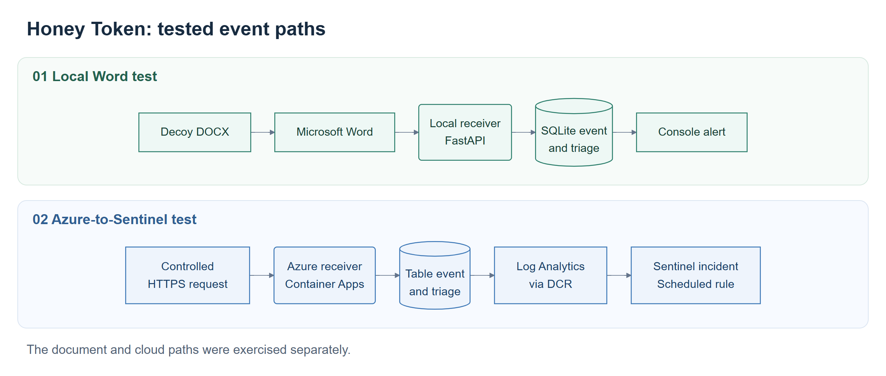

# Honey Token

Extended a local Python document-honeytoken service into an Azure receiver connected to Microsoft Sentinel. Added durable cloud storage, managed-identity ingestion, and a scheduled detection rule, then traced controlled callbacks through to a Sentinel incident.

The work also covered the document side: a generated DOCX opened in Word and requested its local callback. That test ran separately from the Azure callback test.

**Stack:** Python, FastAPI, SQLite, Azure Table Storage, Container Apps, Bicep, Log Analytics, KQL, Microsoft Sentinel, Docker, GitHub Actions.

## Work completed

- Added Azure Table Storage while retaining the local SQLite backend.
- Deployed the receiver with management routes disabled and managed-identity access to ACR, Table Storage, and the Data Collection Rule.
- Fixed a failed ingestion endpoint and traced subsequent events into `CanaryHit_CL` and a high-severity Sentinel incident.
- Exercised scanner classification, duplicate suppression, token revocation, and local SMTP delivery.
- Fixed SMTP failure handling so recorded callbacks still returned the pixel and attempted Sentinel ingestion.
- Added regression coverage for notification failures and malformed management credentials; the suite reached 16 passing tests.
- Restricted the Docker build context, bound Compose to loopback, and disabled access logs that contained callback tokens.

## Results

Word 16.0.20326.20132 retrieved the local document's callback. The receiver stored the event, assigned high severity, and recorded a console alert. In the separate Azure run, controlled HTTPS requests produced stored events, Log Analytics rows, and a Sentinel incident. A repeated request remained in storage while its notification was suppressed. A local SMTP sink received one email for two callbacks within the suppression window.

The [case study](CASE_STUDY.md) follows the implementation and the failures fixed along the way. The [screenshot walkthrough](docs/evidence/public/README.md) contains the application captures and sanitized records from the work.

The project focused on document callbacks and event handling. [Operational limits](LIMITATIONS.md) and [viewer coverage](COMPATIBILITY.md) describe the boundaries of the work.

## Repository guide

| File | Contents |
| --- | --- |
| [Case study](CASE_STUDY.md) | Build sequence, fixes, and outcomes |
| [Architecture](ARCHITECTURE.md) | Local and cloud paths used in the work |
| [Azure deployment](AZURE_DEPLOYMENT.md) | Resources and permissions deployed |
| [Sentinel](SENTINEL.md) | Ingestion failure, rule configuration, and incident |
| [Tests](TESTING.md) | Scenarios exercised and recorded results |
| [Setup](docs/SETUP.md) | Commands, API examples, and SMTP configuration |
| [Security](SECURITY.md) | Controls implemented and deployment constraints |
| [Compatibility](COMPATIBILITY.md) | Document viewer results |
| [Cost and teardown](COST_AND_TEARDOWN.md) | Resource lifecycle and cleanup command |
| [Cloud components](docs/CLOUD_COMPONENTS.md) | Implementation inventory |

The lab used synthetic documents. Deployment is limited to systems the operator owns or is authorized to monitor.

## License

MIT
