# Honey Token - screenshot walkthrough

Project walkthrough recorded on 7 September 2026, covering setup, deployment, document retrieval, event triage, Sentinel ingestion, and tests. Word and GitHub images are application captures; Azure images use saved deployment responses and query results.

Account details, email addresses, source IPs, tenant/subscription identifiers, callback tokens, and resource endpoints are redacted or excluded. Raw records remain outside this package.

Evidence files are stored in this folder. The offline `index.html` gallery works after downloading the folder. Image hashes are recorded in [captions.json](captions.json).

## Browse the evidence

[Deployment](#03-infrastructure-deployment) · [Word callback](#07-word-callback-and-triage) · [Sentinel incident](#11-sentinel-incident) · [Tests](#13-local-regression-and-smtp-delivery)

## 01. Purpose and architecture

**Design summary** - Source: `ARCHITECTURE.md`.

Extended the local document-token receiver with Azure Table Storage and Sentinel ingestion. Word and cloud callbacks were exercised separately.

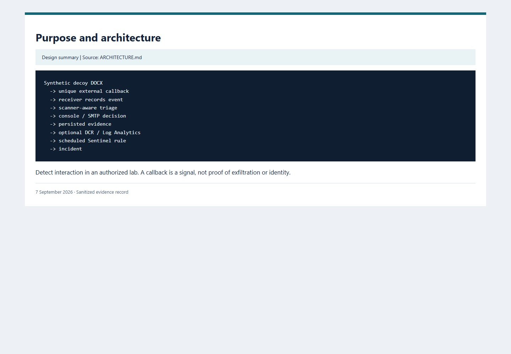

## 02. Starting state and baseline

**Archived record, captured 2026-09-07** - Source: `00-azure-start-state.json + docs/BASELINE.md`.

Recorded the local SQLite starting point and nine passing baseline tests before adding the Azure adapters.

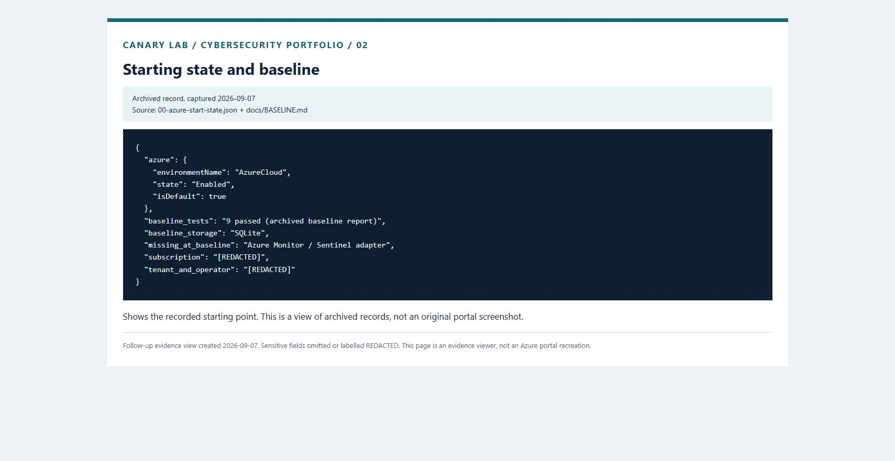

## 03. Infrastructure deployment

**Archived Azure deployment response** - Source: `03-bicep-final-deployment.json`.

Deployed the Bicep resources successfully. Resource identifiers and endpoint values are omitted from the saved response.

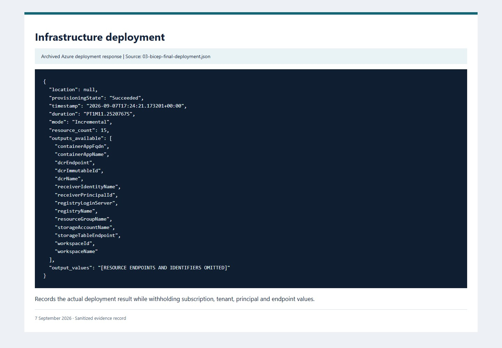

## 04. Receiver security configuration

**Deployment security summary** - Source: `infra/main.bicep`.

Summarized the security settings implemented in the deployment template: shared keys and registry admin access disabled, HTTPS required, and management routes disabled in receiver-only mode.

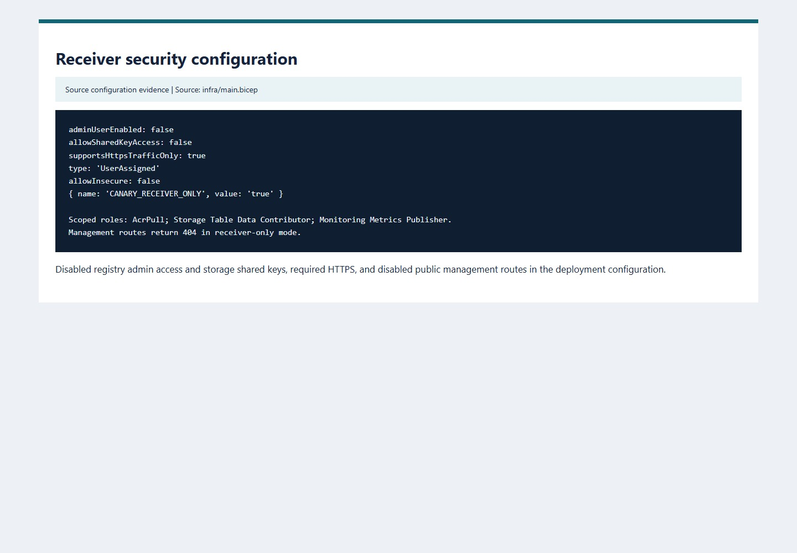

## 05. Deployed receiver health

**Archived HTTP result** - Source: `09-container-app-health.json`.

Requested the deployed health endpoint; it returned HTTP 200 with receiver-only mode and Azure Table Storage.

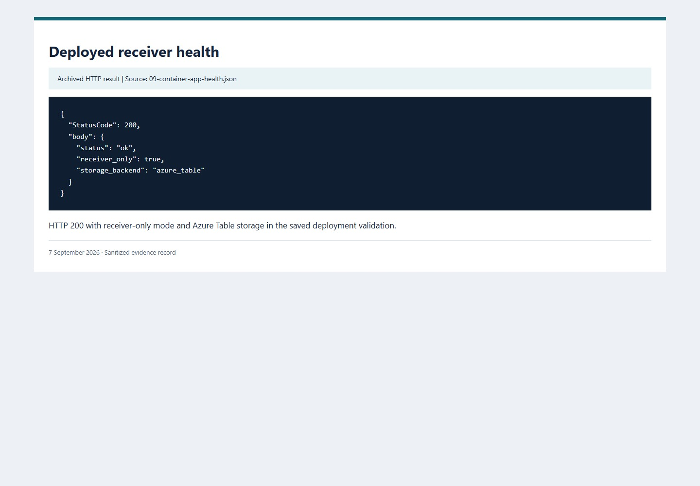

## 06. Word renders the synthetic decoy

**Microsoft Word UI capture** - Source: `Word 16.0.20326.20132`.

Opened the generated synthetic document in Word. The local callback it produced is recorded in image 07.

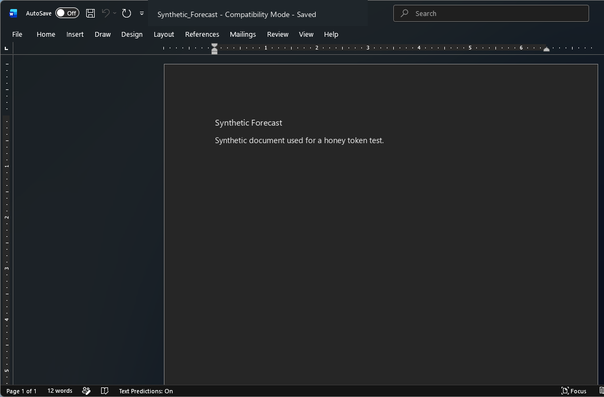

## 07. Word callback and triage

**Archived event from observed Word open** - Source: `word-viewer-result.json`.

Captured the Office User-Agent and high-severity event when Word requested the loopback pixel.

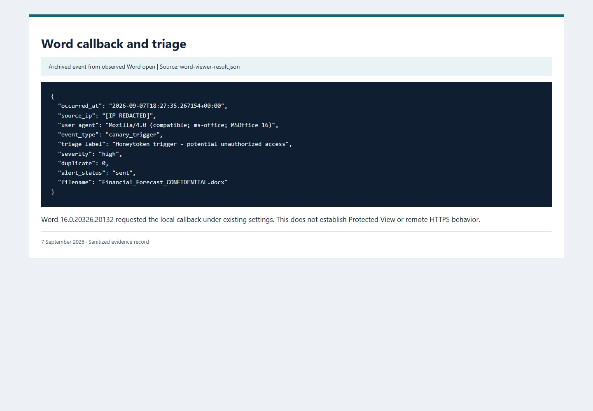

## 08. Persisted events and delivery outcomes

**Archived Azure Table query** - Source: `table-events-sanitized.json`.

Queried stored events and retained both successful delivery outcomes and the first failed ingestion attempt.

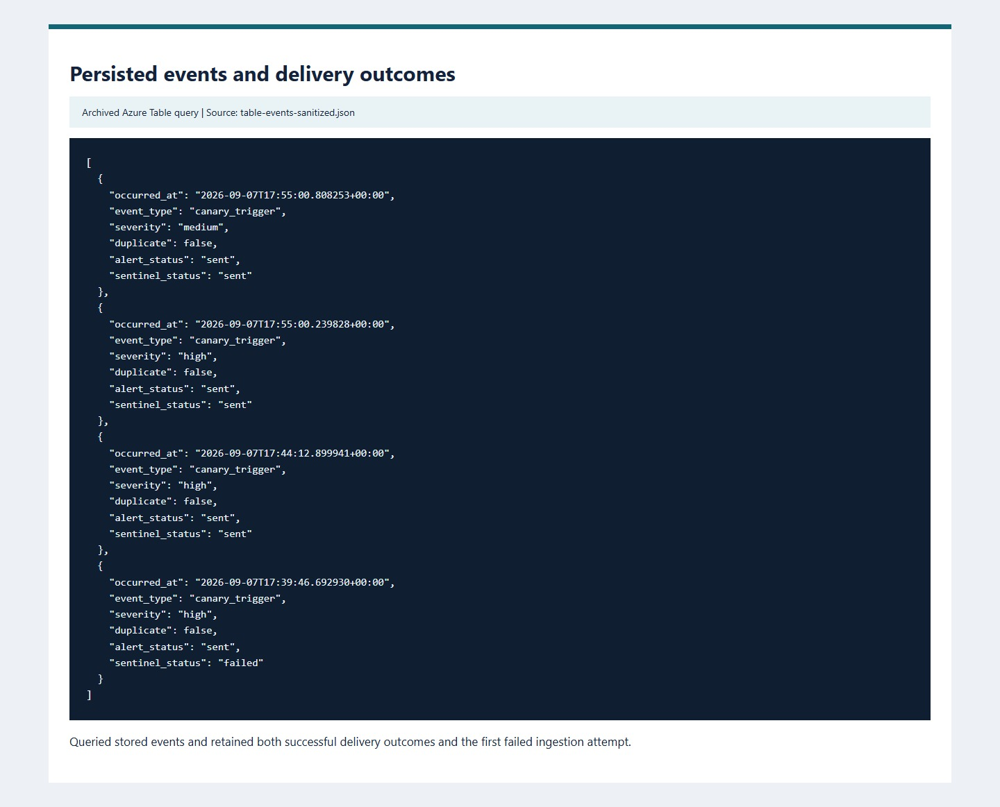

## 09. Log Analytics ingestion

**Archived CanaryHit_CL query** - Source: `log-analytics-latest.json`.

Queried four ingested records, including a scanner classification and a suppressed repeat notification.

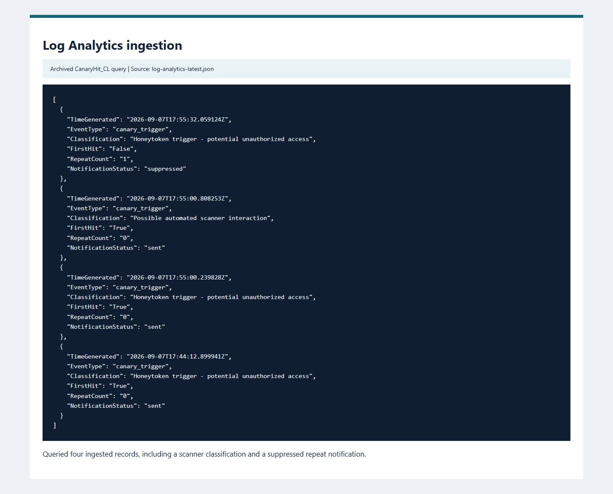

## 10. Sentinel analytic rule

**Archived rule configuration** - Source: `sentinel-rule.json`.

Deployed a five-minute Sentinel rule with a ten-minute lookback and incident creation enabled. The query selected all callback rows; scanner and repeat rows were included.

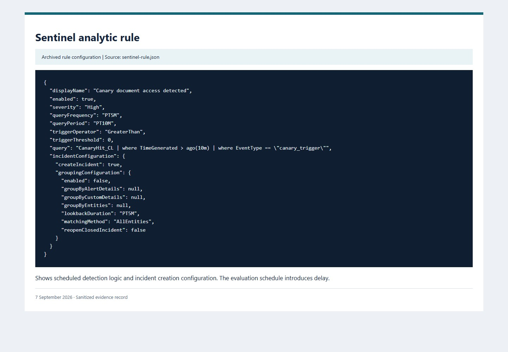

## 11. Sentinel incident

**Archived Sentinel incident response** - Source: `sentinel-incidents.json`.

Recorded the resulting high-severity Sentinel incident. Account and resource identifiers are omitted.

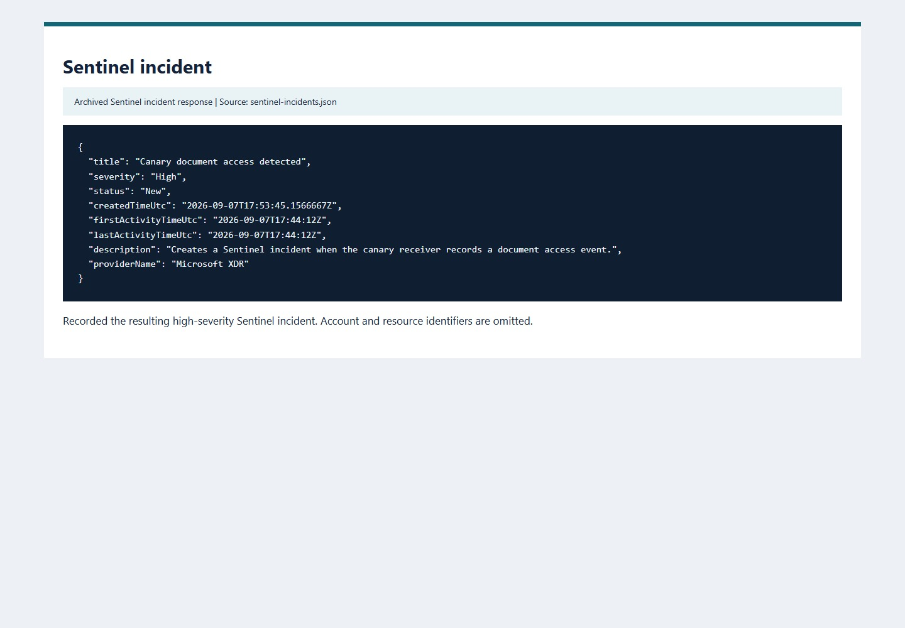

## 12. GitHub Actions test run

**GitHub UI capture** - Source: `Job 101836165394 in Actions run 34152044446`.

The main-branch Actions test job completed successfully and recorded 16 passing tests.

## 13. Local regression and SMTP delivery

**Recorded test output** - Source: `tests/test_smtp_delivery.py + portfolio/pytest.txt`.

The integration test opened a real loopback SMTP connection, sent one DATA message after two callbacks, and confirmed two persisted events with sent/suppressed alert states. SMTP identities and callback tokens are redacted from the public record.

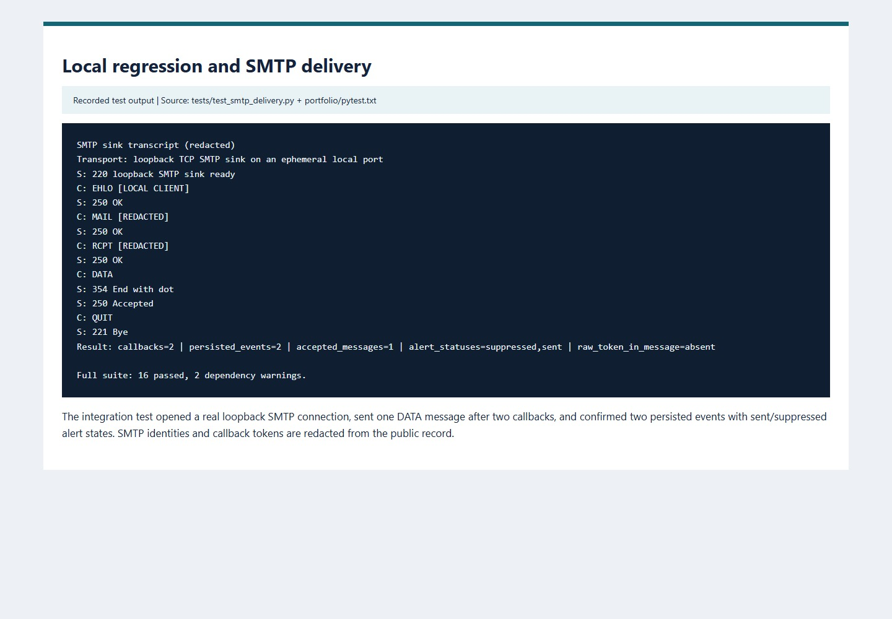

## 14. Secret scanning

**Gitleaks output** - Source: `portfolio/gitleaks.txt`.

Scanned the tracked history with Gitleaks; the recorded scan found no secrets.

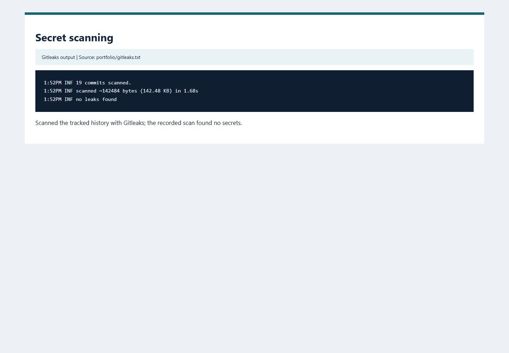

## 15. Limitations and teardown status

**Operational notes** - Source: `LIMITATIONS.md + COST_AND_TEARDOWN.md`.

Recorded the resource state at the end of the run. The cleanup command and operational constraints are documented separately.

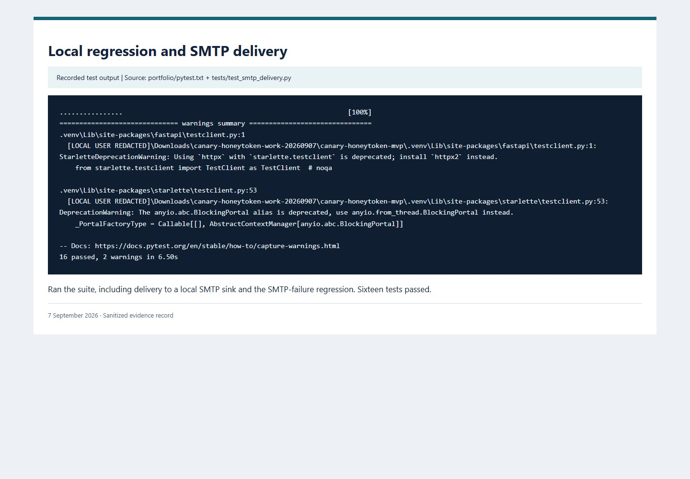
