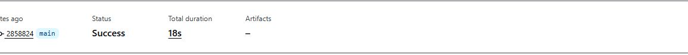
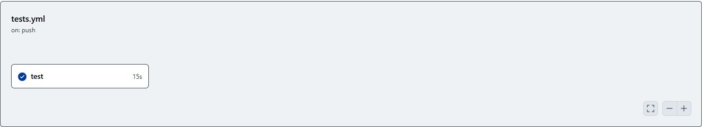
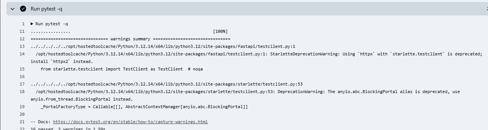
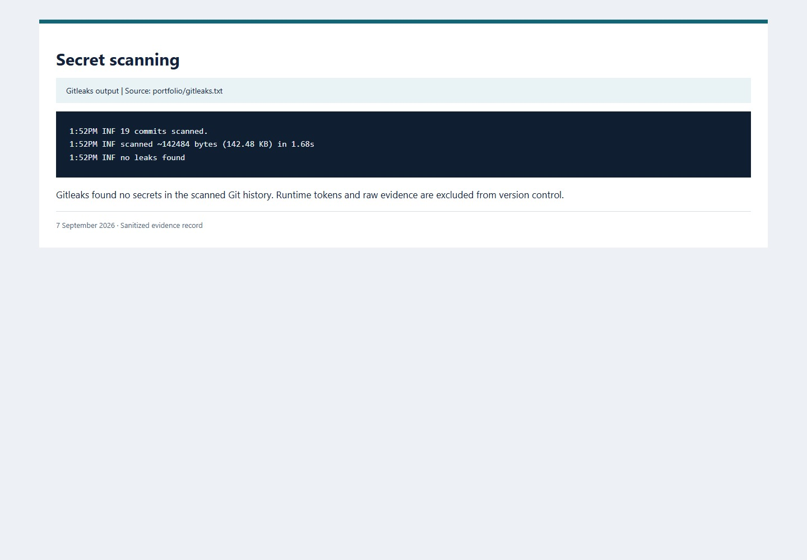
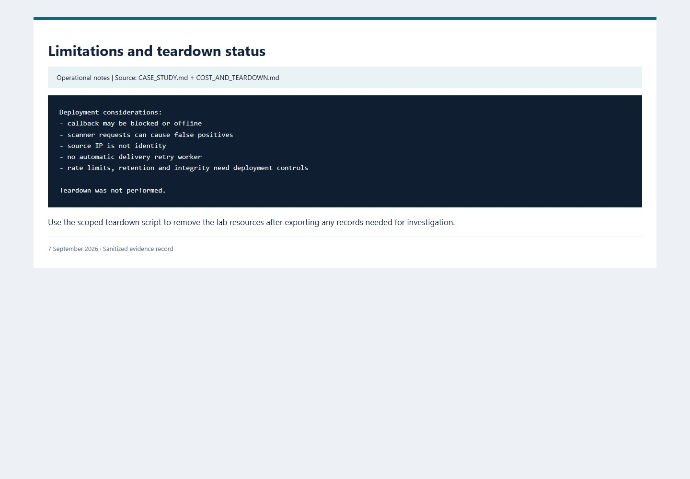

# Honey Token — validation walkthrough

Project walkthrough recorded on 7 September 2026, covering setup, deployment, document retrieval, event triage, Sentinel ingestion, and tests. Word and GitHub images are application captures. Azure images display saved API and query records, rather than the Azure portal. No teardown was performed.

Account details, email addresses, source IPs, tenant/subscription identifiers, callback tokens, and resource endpoints are redacted or excluded. Raw records remain outside this package.

[Open the offline gallery](index.html). Image hashes are recorded in [captions.json](captions.json).

## 01. Purpose and architecture

**Design summary** — Source: `ARCHITECTURE.md`.

Detect interaction in an authorized lab. A callback is a signal, not proof of exfiltration or identity.

## 02. Starting state and baseline

**Archived record, captured 2026-09-07** — Source: `00-azure-start-state.json + docs/BASELINE.md`.

Shows the recorded starting point. This is a view of archived records, not an original portal screenshot.

## 03. Infrastructure deployment

**Archived Azure deployment response** — Source: `03-bicep-final-deployment.json`.

Records the actual deployment result while withholding subscription, tenant, principal and endpoint values.

## 04. Receiver security configuration

**Source configuration evidence** — Source: `infra/main.bicep`.

Shows checked-in controls. Role configuration alone does not prove a fresh live access review.

## 05. Deployed receiver health

**Archived HTTP result** — Source: `09-container-app-health.json`.

HTTP 200 with receiver-only mode and Azure Table storage in the saved deployment validation.

## 06. Word renders the synthetic decoy

**Microsoft Word UI capture** — Source: `Word 16.0.20326.20132`.

Word displays the generated synthetic document. The corresponding local callback event appears in image 07.

## 07. Word callback and triage

**Archived event from observed Word open** — Source: `word-viewer-result.json`.

Word 16.0.20326.20132 requested the local callback under existing settings. This does not establish Protected View or remote HTTPS behavior.

## 08. Persisted events and delivery outcomes

**Archived Azure Table query** — Source: `table-events-sanitized.json`.

Saved Azure Table rows retain alert and ingestion outcomes, including scanner severity. These rows are not duplicates; suppression is verified by the regression tests.

## 09. Log Analytics ingestion

**Archived CanaryHit_CL query** — Source: `log-analytics-latest.json`.

Saved query rows connect receiver events to the SIEM ingestion path. Raw callback tokens and source IPs are excluded.

## 10. Sentinel analytic rule

**Archived rule configuration** — Source: `sentinel-rule.json`.

Shows scheduled detection logic and incident creation configuration. The evaluation schedule introduces delay.

## 11. Sentinel incident

**Archived Sentinel incident response** — Source: `sentinel-incidents.json`.

Actual saved incident response; owner, incident URL, related resource IDs and tenant identifiers are omitted.

## 12. GitHub main CI status

**capture of completed GitHub run** — Source: `Actions run 34152044446, commit 2858824`.

The completed main-branch run reports Success. Account details and navigation are excluded from the crop.

## 13. GitHub test job

**GitHub UI capture** — Source: `Actions run 34152044446`.

The workflow graph shows a successful test job. This is a cropped view of the actual GitHub page.

## 14. GitHub pytest log

**GitHub UI capture** — Source: `Job 101836165394 in Actions run 34152044446`.

The actual pytest log shows completed assertions and dependency warnings. The full local summary is also visible in image 15.

## 15. Local regression and SMTP delivery

**verification output** — Source: `portfolio/pytest.txt + tests/test_smtp_delivery.py`.

The suite includes a real ephemeral loopback SMTP sink, triage-field verification, duplicate suppression, and notification-failure isolation. No external mailbox credentials are used.

## 16. Secret scanning

**Gitleaks output** — Source: `portfolio/gitleaks.txt`.

Gitleaks found no secrets in the scanned Git history. Runtime tokens and raw evidence are excluded from version control.

## 17. Limitations and teardown status

**Operational notes** — Source: `CASE_STUDY.md + COST_AND_TEARDOWN.md`.

Use the scoped teardown script to remove the lab resources after exporting any records needed for investigation.

