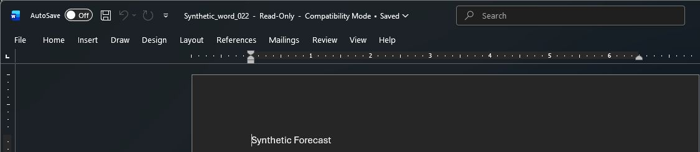

# Severity-aware detection results

Sample uses synthetic financial data only. The current sample filename is `Financial_Records_CONFIDENTIAL.docx`; the records below retain the filenames used during this run.

Receiver **0.2.2**, 8 September 2026 UTC (7 September locally). These results extend the [original evidence](../README.md); they do not reclassify the historical runs.

## Callback decisions

| Request | Classification | Severity | Repeat count | Notification | Sentinel |
| --- | --- | --- | --- | --- | --- |
| Controlled first access | honeytoken_access | High | 0 | Sent | High incident 18 |
| First repeat | honeytoken_access | High | 1 | Suppressed | Retained, no new alert |
| Second repeat | honeytoken_access | High | 2 | Suppressed | Retained, no new alert |
| Scanner first access | automated_scanner | Medium | 0 | Sent | Medium incident 16 |
| Scanner repeat | automated_scanner | Medium | 1 | Suppressed | Retained, no new alert |
| Word document open | honeytoken_access | High | 0 | Sent | High incident 17 |

All six events persisted and reached Log Analytics. [Table events](table-events.json) and [SIEM rows](log-analytics.json) retain matching event IDs, classification, severity, flags, repeat counts, and delivery outcomes. [Callback responses](callback-responses.json) record the five controlled HTTP requests; Word is recorded separately below. “Genuine” scenario labels identify controlled non-scanner requests, not proof of a human user.

## Word to Sentinel

Word 16.0 opened `Synthetic_word_022.docx` from local disk with existing Office and endpoint policies. It requested the external Azure image at `2026-09-08T00:29:38.667730Z`. The screenshot is a cropped capture of Word; it shows the open document, while the records below establish delivery.

| Stage | Matching record |
| --- | --- |
| Word open | [Open result](word-open.json), receiver version 0.2.2 |
| Table and Log Analytics | Event `762163e649744aa4bd129ef081e1db4d`; canary hash `658961b921ce90ab` |
| Sentinel alert | `968cbcf9-a46a-bec0-0a20-7e752761eea5`, High |
| Sentinel incident | 17, High, created `2026-09-08T00:39:27.81Z` |

The [incident export](sentinel-incidents.json) preserves the alert's custom event details and the incident-to-alert match. The event ID joins Table and Log Analytics to the SecurityAlert custom details; `SystemAlertId` joins the alert to the incident alerts API. No controlled HTTP request was sent to the Word token during this run.

## Rules and investigation

[Deployed rule records](sentinel-rules.json) contain the live query, severity, schedule, custom details, entity mapping, and canary grouping settings. First non-scanner hits and scanner first hits use separate High and Medium rules. Both exclude repeated rows.

[KQL execution results](kql-execution.json) show all 11 repository queries ran successfully. Investigation query counts include earlier workspace events as well as this six-event release run; they are not six-event-only totals. [Query index](../../../kql/README.md).

## SMTP and security

The [SMTP transcript](smtp-result.txt) records an actual loopback send through the receiver: two callbacks, two persisted events, one accepted `DATA` message, and a suppressed repeat. Cloud SMTP was not configured.

[Security checks](security-checks.json) record HTTPS ingress, disabled ACR admin, the receiver's three roles, and the console-log token check. [Cleanup](cleanup.json) records revoked test tokens and removal of temporary operator access. [Release validation](../../../../VALIDATION.md) includes 43 passing tests, infrastructure compilation, CI, the history scan, and remaining limitations.

The Azure records are field-selected exports from deployed APIs and queries. Source IPs, account/resource identifiers, raw callback URLs, and tokens are excluded. They are data records, not Azure portal screenshots. The original Word capture and full responses remain private.
